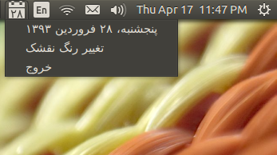

Gahshomar (گاه‌شمار)
================
A Persian (Jalali/Farsi) calendar which provides a basic appindicator.

Screenshot
================

Requirements
================
Khayyam python package (https://pypi.python.org/pypi/Khayyam)
Yapsy python package (https://pypi.python.org/pypi/Yapsy)

Installation
================
See the Wiki

Support or Contact
================
Having troubles? Fill an issue at *https://github.com/Gahshomar/gahshomar*.